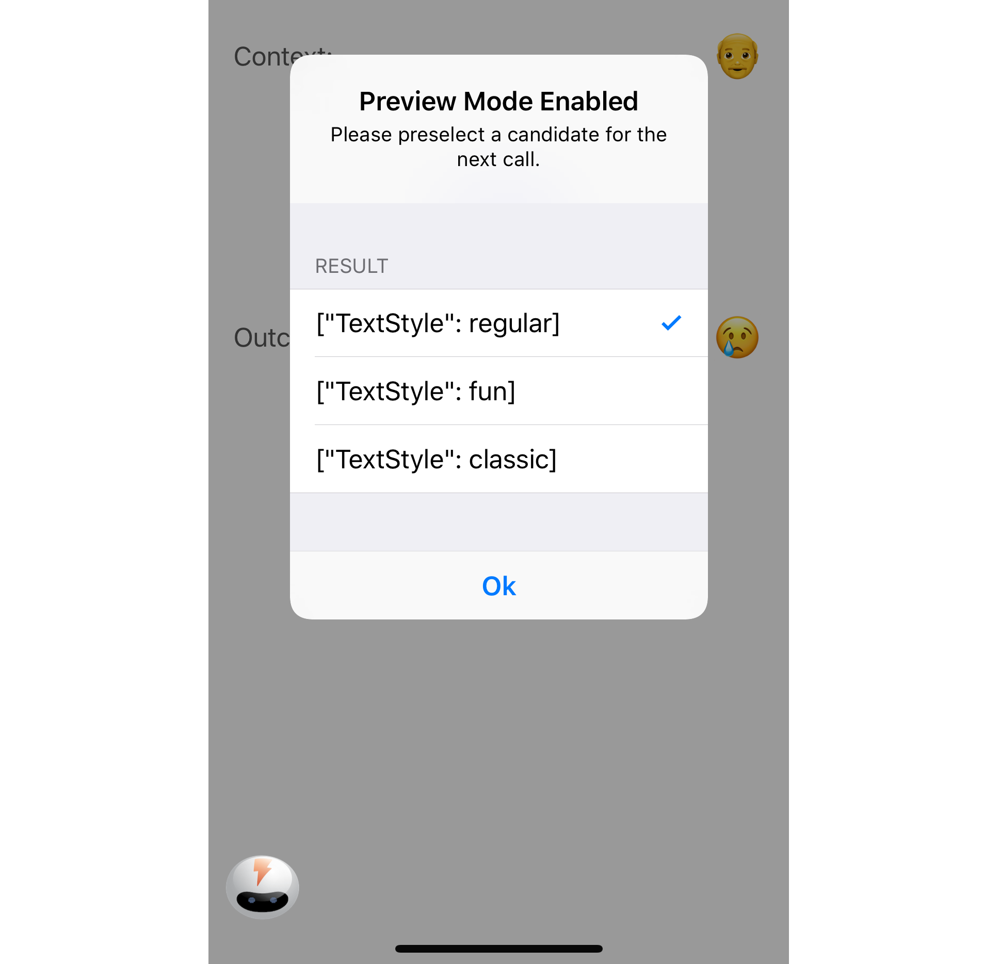

# Amp-iOS
<sup>by Scaled Inference</sup>

<br>
iOS client for Amp.ai.

## Amp.ai
Amp.ai is a cloud AI platform that can enhance any software application that integrates with it by making intelligent, goal-driven, context-sensitive decisions. Think of it as A/B testing on steroids. While A/B testing provides information about what choice to take across all users, Amp.ai will provide you with a decision that is specific to a context and will continue to improve and provide your users with the best decision based on the context they are in.

## Compatibility
The iOS client supports both Objective-C and Swift projects that are compatible with Swift 4 and iOS 9 and above.

## Getting Started
### Reference Documentation
1. Install Xcode from the App Store
2. [Apple Developer](https://developer.apple.com/documentation/)
3. [Xcode](https://developer.apple.com/xcode/)
4. [Swift](https://developer.apple.com/swift/)
5. [iOS](https://developer.apple.com/ios/)
6. [CocoaPods](https://cocoapods.org)

## CocoaPods

### Add the AmpiOS pod under the target section of your Podfile
``` Ruby
platform :ios, '9.0'
use_frameworks!

target '<Your Target Name>' do
    pod 'AmpiOS'
end
```
You can use a specific version of `AmpiOS`, by specifying the version:
``` Ruby
pod 'AmpiOS', '~> 1.1'
```

### Install the AmpiOS pod
``` Ruby
$ pod install
```
To upgrade to the latest version of `AmpiOS` in the future, run:
``` Ruby
$ pod update
```
After installing the pods, Xcode will prompt you to reopen the project using the workspace file.

## AmpiOS

### Initialization
To use amp, import the Amp framework and create an amp instance with a class. The Amp instance should be created at the application startup to handle session lifecycle properly. Here is an example of initializing Amp in your `AppDelegate`:

>Swift
``` Swift
import UIKit
import AmpiOS

@UIApplicationMain
class AppDelegate: UIResponder, UIApplicationDelegate {
    ...
    func application(_ application: UIApplication, didFinishLaunchingWithOptions launchOptions: [UIApplicationLaunchOptionsKey: Any]?) -> Bool {
        amp = Amp(key: "<your_project_key>")
        ...
        return true
    }
}
```

>Objective-C
``` ObjectiveC
#import "AppDelegate.h"
@import AmpiOS;

@implementation AppDelegate

- (BOOL)application:(UIApplication *)application didFinishLaunchingWithOptions:(NSDictionary *)launchOptions {
    _amp = [[Amp alloc] initWithKey:@"<your_project_key>" userId:<userId> config:<Config>];
    ...
    return YES;
}
```

These lines initialize the amp and session instances that represent a single session in the Amp project corresponding to the `projectKey` that will be given to you. How to define a user session is completely up to you. Please see [this section](#session) for detailed information.

### Context
Observe the context by sending events to Amp.ai. Events in a session that precede a decision point form the "context" for that decision. Amp automatically discovers relevant contexts for decisions as the data evolves, and does so continuously. You have the option of sending additional context by explicitly using the 'observe' API call. For example, a business-specific context could be a Customer context, with a property, "type", and a value of "Free" or "Premium".

>Swift
``` Swift
amp.observe("Customer", ["type": "Premium"])
```

>Objective-C
```ObjectiveC
[_amp observeWithName:@"Customer" properties:@{@"type": @"Premium"}];
```

### Decide
Leverage the power of Amp.ai by invoking the `decide` API call. The call consists of decision candidates that are presented to Amp. The first candidate in the list is treated by Amp as the `default`, and this decision would be used in the baseline group. Amp will pick the decision that results in maximizing the probability of improving your business metrics. For example, users in Japan using the Chrome browser may prefer to purchase ice-cream instead of chocolate. Amp would learn this behavior as it observes that this user segment typically chooses this action and results in improved sales.

>Swift
``` Swift
let colorDecision = amp.decide("Snack", ["choice":["Chocolate", "Ice Cream", "Cookies"]])
```

>Objective-C
``` ObjectiveC
NSDictionary* decision = [_amp decideWithName:@"Snack" candidates:@{@"choice": @[@"Chocolate", @"Ice Cream", @"Cookies"]} ttl:nil];
```

### Outcome
The outcome is simply the business metric you are optimizing for. Amp can optimize multiple metrics simultaneously. Once the metric has been defined, Amp.ai is informed of the outcome by an `observe` call.

>Swift
``` Swift
amp.observe("Sale", [])
```

>Objective-C
```ObjectiveC
[_amp observeWithName:@"Sale" properties:@{}];
```

## Advanced settings

### LoadRules
Use this when you need to ensure that decisions made through `decide()` are made based on the rules provided by the server. A common use case is when a one-time decision must be made on start of the application. If the rules are already available, the callback will be called immediately from this method. If the rules are not ready, it will wait for the sync to complete and callback will be executed.

>Swift
``` Swift
dialog.show()
amp.loadRules(timeout: timeoutInMilliseconds) { error in
        // The callback is executed on the main thread, so it's safe to change the UI
        dialog.dismiss()

        // Chose a color for button that will suite current customer
        let colorDecision = amp.decide(name: "ButtonColor", candidates: ["color":["blue", "orange", "green"]])
        ...
}
```
>Objective-C
``` ObjectiveC
[dialog show];
[amp loadRulesWithTimeout:timeoutInMilliseconds callback:^(NSError *error) {
        // The callback is executed on the main thread, so it's safe to change the UI
        [dialog dismiss];

        // Chose a color for button that will suite current customer
        NSDictionary* colorDecision = [amp decideWithName:"ButtonColor" candidates: @{@"color":@[@"blue", @"orange", @"green"]}];
        ...
}];
```

### Session

The default behavior is to end the session after inactivity period (the app in background state and no events were fired) becomes more than `sessionTTL`, or time interval since session creation is more than `sessionLifetime`.
`sessionTTL`, `sessionLifetime` could be set up during amp initialization. You could also explicitly finish the current session and start a new one using the following method:

>Swift
``` Swift
amp.startNewSession()
```

>Objective-C
``` ObjectiveC
[amp.startNewSession startNewSession];
```

### Builtin Events
By default, when using the AmpiOS client, we will observe taps through the `AmpTap` event on buttons and general session information on the `AmpSession` event. 


### Configuration Options
The following options are available.

|Name|Default Value|Data Type|Details|
|----|:-----------:|:-------:|-------|
|logLevel|.warn|LogLevel|.error, .warn, .info, .debug|
|builtinEvents|[String]|Array|Events that are created upon initialization|
|sessionTTL|15 minutes|Int64|Session time to live in milliseconds|
|sessionLifetime|24 hours|Int64|Session lifetime in milliseconds|

### Preview mode

When it’s time to test the variants of the decision call, the preview mode will help to do just that. When enabled, it will allow preselecting the result of the next decide call. Note: don’t use it in the release version, as it’s only for testing.

To turn on the preview mode, enable it in the Amp config:

>Swift
``` Swift
let config = ConfigBuilder()
            .set(previewMode: true)
            .build()
let amp = Amp(key: key, config: config)
``` 
>Objective-C
``` ObjectiveC

Config *config = [[[[ConfigBuilder alloc] init]
                       setWithPreviewMode:@YES] build];
Amp *amp = [[Amp alloc] initWithKey:key userId:nil config:config];
```
Here is how it will look:



## Usage
There are many ways in which you will want to use Amp. You may want to track how often each page is typically visited in your application or how far down a scrollable page your user scrolls.  If your application requires sign up and registration, you may want to track the occurrence of taps on the sign up button because you may want to increase your user's sign up rate using Amp.  The possibilities are endless, and with Amp, not only will it track whatever you ask of it, it will also check the context in which these events occurred.  With this information, Amp will make the best decisions to improve on whatever business goals you have.
Below are just a few examples on how you might make `observe` and `decide` requests in your application.

### Observe Usages
#### I want to track the pages that are visited
This is one use of the iOS lifecycle methods, `viewDidLoad`.

>Swift
``` Swift
override func viewDidLoad() {
    super.viewDidLoad()

    if let title = self.navigationItem.title {
        amp?.observe(name: "AmpPage", properties: ["title": title])
    }
}
```

>Objective-C
```ObjectiveC
- (void)viewDidLoad {
    [super viewDidLoad];
    
    NSString* title = [[self navigationItem] title];
    if (title) {
        [_amp observeWithName:@"AmpPage" properties:@{@"title": title}];
    }
}
```

#### I want to track button taps
Amp already tracks these for you through one of our built-in events, `AmpTap`.  You just use these or you can create customized ones as well through an action method.

>Swift
``` Swift
@IBAction func buttonPressed(_ sender: UIButton) {
    amp?.observe(name: "Signup", properties: [:])
}
```

>Objective-C
```ObjectiveC
- (IBAction)buttonPressed:(UIButton *)sender {
    [_amp observeWithName:@"Signup" properties:@{}];
}
```

#### I want to track what people are searching for
Use a delegate method to help you here.

>Swift
``` Swift
// MARK: - UISearchBarDelegate methods

func searchBarTextDidEndEditing(_ searchBar: UISearchBar) {
    if let textValue = searchBar.text {
        amp?.observe(name: "Search", properties: ["value": textValue])
    }
}
```

>Objective-C
```ObjectiveC
-(void)searchBarTextDidEndEditing:(UISearchBar *)searchBar {
    NSString* textValue = [searchBar text];
    if (textValue) {
        [_amp observeWithName:@"Search" properties:@{@"value": textValue}];
    }
}
```

#### I want to track how much my users scroll on the page
The following example only observes scrolling if greater than 100 using the UITableViewDelegate.

>Swift
``` Swift
// MARK: - UITableViewDelegate methods

func scrollViewWillEndDragging(_ scrollView: UIScrollView, withVelocity velocity: CGPoint, targetContentOffset: UnsafeMutablePointer<CGPoint>) {
    if targetContentOffset.pointee.y > 100 {
        amp?.observe(name: "PageScroll", properties: ["page":"Welcome"])
    }
}
```

>Objective-C
```ObjectiveC
- (void)scrollViewWillEndDragging:(UIScrollView *)scrollView withVelocity:(CGPoint)velocity targetContentOffset:(inout CGPoint *)targetContentOffset {

    if (targetContentOffset->y > 100) {
        [_amp observeWithName:@"AmpScrollDrag" properties:@{}];
    }
}
```


### Decide Usages

#### I want to update the style of a control in my view

>Swift
``` Swift
override func viewWillAppear(_ animated: Bool) {
    super.viewWillAppear(animated)

    let decision = amp.decide(name: "ButtonStyle", candidates: ["color": ["orange", "blue", "green"]])
    
    let colors = ["orange": UIColor.orange, "blue": UIColor.blue, "green": UIColor.green]
    pressMeBtn.setTitleColor(colors[decision["color"] as! String], for: .normal)
}
```

>Objective-C
```ObjectiveC
- (void)viewWillAppear:(BOOL)animated {
    [super viewWillAppear:animated];
    
    NSDictionary* decision = [_amp decideWithName:@"ButtonStyle" candidates:@{@"color": @[@"orange", @"blue", @"green"]} ttl:nil];
    
    NSDictionary* colors = @{@"orange": [UIColor orangeColor], @"blue": [UIColor blueColor], @"green": [UIColor greenColor]};
    
    [_pressMeBtn setTitleColor:[colors objectForKey:[decision objectForKey:@"color"]] forState:UIControlStateNormal];
}
```

#### I want to determine which segue to perform
You may want to determine whether creating a New Features wizard is really helpful or if your users are just skipping it.  Maybe you are trying to decide the flow of a sequence of pages.  Whatever your use case you can apply decision-making to determine which viewController to navigate to next.  Below is a simple example of deciding which segue to use when the orientation changes.

> Swift
``` Swift
NotificationCenter.default.addObserver(self, selector: #selector(ViewController.orientationChanged), name: NSNotification.Name.UIApplicationDidChangeStatusBarOrientation, object: nil)
...
@objc func orientationChanged(notification: Notification) {
    let deviceOrientation = UIDevice.current.orientation
    let decision = amp.decide("LandscapeView", ["view": ["SplitLeft", "Normal", "SplitRight"]])

    if UIDeviceOrientationIsLandscape(deviceOrientation) {
        self.performSegue(withIdentifier: "decision["view"] as! String, sender: self)
    }
}
```

>Objective-C
```ObjectiveC
[NSNotificationCenter.defaultCenter addObserver:self selector:@selector(orientationChanged:) name:@"UIApplicationDidChangeStatusBarOrientationNotification" object:NULL];
...
- (void)orientationChanged:(NSNotification *) sender {                        }
    UIDeviceOrientation deviceOrientation = [UIDevice currentDevice].orientation;
    NSDictionary* decision = [_amp decideWithName:@"LandscapeView" candidates:@{@"view": @[@"SplitLeft", @"Normal", @"SplitRight"]} ttl:nil];
    
    if (UIDeviceOrientationIsLandscape(deviceOrientation)) {
        [self performSegueWithIdentifier:[NSString stringWithFormat:@"%@", [decision objectForKey:@"view"]] sender:self];
    }
}
```
